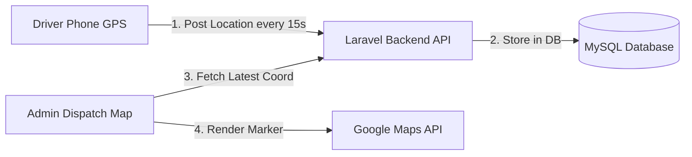

# Live Driver Tracking Implementation Plan

Yes! It is **100% possible** to implement a live driver tracking system (like Uber or InDrive) using **just your existing Google Maps API Key** along with standard device GPS and your Laravel backend. 

You do not need to purchase any expensive third-party tracking services.

---

## 🛠️ How it Works (The Architecture)

The system works by connecting three simple components:



1.  **The Driver's App (Capacitor Geolocation)**: Periodically reads the phone's native GPS coordinates.
2.  **Your Server (Laravel)**: Receives the coordinates and saves them in the database with a timestamp.
3.  **Your Admin Panel (Filament & Google Maps)**: Periodically fetches the driver's latest coordinates and moves their marker on the map.

---

## 🗺️ What the Google Maps API Key Does (and Doesn't) Do

*   **What Google Maps API does:** 
    *   Renders the visual map on the admin dashboard.
    *   Draws the path line between stops (using the **Directions API**).
    *   Positions the car/driver icon on the map.
*   **What Google Maps does NOT do (Handle for free by your system):**
    *   It does **not** track the phone's location. Your driver's phone has a built-in GPS receiver that is **completely free** to use via the browser's Geolocation API or Capacitor's Geolocation Plugin.
    *   It does **not** store the coordinates. Your Laravel database stores them.

---

## 📋 Step-by-Step Implementation Plan

### Step 1: Update the Database Schema
Add a new database table in Laravel to keep track of the driver's current coordinates:
```php
Schema::create('driver_locations', function (Blueprint $table) {
    $table->id();
    $table->foreignId('user_id')->constrained()->onDelete('cascade'); // The Driver
    $table->decimal('latitude', 10, 8);
    $table->decimal('longitude', 11, 8);
    $table->timestamp('updated_at'); // Last time they reported
});
```

### Step 2: Create the Location Update API (Driver side)
In `routes/api.php`, add a secure endpoint for the driver's app to submit their location:
*   **POST** `/api/driver/location` (requires driver token).
*   In the Vue driver app, run a background timer (using `setInterval`) that calls the native GPS sensor every **15 to 30 seconds** and sends the latitude/longitude to this endpoint.

### Step 3: Create the Admin Map Widget (Dispatcher side)
In your Filament **Dispatch Dashboard**:
1.  Initialize a Google Map instance using your Google Maps API Key.
2.  Create a polling script (using JavaScript `setInterval` every **10 seconds**) that calls a quick backend endpoint to fetch the latest entries in the `driver_locations` table.
3.  Update the coordinates of the driver's marker on the map:
    ```javascript
    // Move the marker to the new coordinates
    driverMarker.setPosition(new google.maps.LatLng(latestLat, latestLng));
    ```

### Step 4: Choose Sync Speed (WebSockets vs. Polling)
*   **Approach A: Fast Polling (Easiest - Recommended to Start)**: 
    The Admin Dashboard queries your database every 10 seconds. It is extremely simple to code and requires no additional server setup.
*   **Approach B: WebSockets (Real-time - Uber-like)**: 
    Instead of polling, use **Laravel Reverb** (built-in websocket server in Laravel) or **Pusher**. When the driver uploads their location, Laravel broadcasts the event instantly to the admin map. The marker slides smoothly on the screen in real-time.

---

## 💰 Cost & Quota Tips
To keep your Google Maps usage **100% free** (within Google's $200 free monthly credit):
1.  **Don't call Google APIs to get the coordinates**: Only use the phone's hardware GPS via JavaScript's `navigator.geolocation`.
2.  **Minimize Directions API calls**: Only calculate the route line *once* when the dashboard loads. When updating the driver's position icon, just change the marker's latitude/longitude (`setPosition`), which does not cost any API credits.
